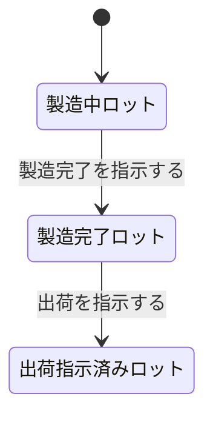

# DSL Semantic Guide

このドキュメントは DSL の各構文要素が**何を意味するか**、および**各ターゲット言語にどう翻訳するか**を定義する。

---

## このガイドの読み方

各DSL構文に対して以下の5層で翻訳規則を記述する：

1. **抽象意味論（Abstract Semantics）**：言語非依存の意味
2. **F# 翻訳**：型・関数への翻訳
3. **Alloy 翻訳**：sig・relation・fact への翻訳
4. **TLA+ 翻訳**：状態変数・アクションへの翻訳
5. **プロパティテスト**：FsCheckジェネレータ・プロパティへの翻訳

ターゲットを追加する場合（例：Rust、TypeScript、Kotlin）、各構文に対応する章を追加する。

---

## レイヤー区分

各章の見出しに以下のラベルを付ける（`dsl/grammar.ebnf` のラベリングと一致）:

| ラベル | 意味 | 対象読者 / 書き手 |
|---|---|---|
| **[CORE]** | ドメインエキスパートが読む層。型構造・振る舞いシグネチャ。 | エキスパート + 技術者 |
| **[VERIFICATION]** | 検証層。値域制約・事前事後条件・不変条件・時相性質。 | 技術者（P4 で導入） |

エキスパートは [CORE] 章のみ目を通せば DSL の意図が把握できる。
[VERIFICATION] 章は AI が Alloy / TLA+ / プロパティテストを生成する際の根拠。

---

## 1. 値型エイリアス　[CORE]

### 構文
```
data 事業部コード = 整数
```

### 抽象意味論
`事業部コード` は `整数` の値を持つが、型レベルで他の整数型と区別される（branded type）。
ある整数を別の整数型として誤って渡すことを防ぐ。

### F# 翻訳
```fsharp
type DivisionCode = DivisionCode of int
```
- 単一ケース判別共用体（branded type）
- 公開コンストラクタでOK（制約がないため）

### Alloy 翻訳
```alloy
sig DivisionCode { value: Int }
```

### TLA+ 翻訳
直接の翻訳は不要。状態変数の型として `Int` を使う際にコメントで言及。

### プロパティテスト
```fsharp
let divisionCodeGen = Gen.map DivisionCode Arb.generate<int>
```

---

## 2. 精錬型（Refined Type）　[VERIFICATION]

### 構文
```
data 金額 = 整数 where 値 >= 0 unit 円
```

### 抽象意味論
`金額` は整数のうち、述語 `値 >= 0` を満たすもの全体。
不正な値（負数）から `金額` を直接構築することはできない。
構築には**検証関数（smart constructor）**を経由する必要がある。

### F# 翻訳
```fsharp
type Amount = private Amount of int64

module Amount =
    let create (value: int64) : Result<Amount, string> =
        if value >= 0L then Ok (Amount value)
        else Error $"金額は0以上である必要があります (入力: {value})"
    
    let value (Amount v) = v
```
- `private` で直接コンストラクタを隠蔽
- `module` でスマートコンストラクタを公開
- `Result<T, E>` で検証失敗を表現
- エラーメッセージには入力値を含める

### Alloy 翻訳
```alloy
sig Amount { value: Int }
fact AmountNonNegative { all a: Amount | a.value >= 0 }
```
- `sig` でレコード定義
- `fact` で値域制約

### TLA+ 翻訳
```tla+
Amount == { x \in Int : x >= 0 }
```
- 集合内包記法で値域を絞る

### プロパティテスト
```fsharp
let amountGen = 
    Gen.choose (0, Int32.MaxValue)
    |> Gen.map (int64 >> Amount.create)
    |> Gen.map (function Ok a -> a | Error _ -> failwith "unreachable")
```

---

## 3. 直積型（Product / Record）　[CORE]

### 構文
```
data ロット番号 = ロット番号年度 AND ロット番号保管場所 AND ロット番号連番
```

### 抽象意味論
`ロット番号` は3つの構成要素を**同時に**持つ。
部分的な `ロット番号`（年度だけ持つ、など）は存在しない。
構成要素はそれぞれ独立に変化しうる。

### F# 翻訳
```fsharp
type LotNumber = {
    Year: LotNumberYear
    StorageLocation: LotNumberStorageLocation
    Sequence: LotNumberSequence
}
```
- レコード型で表現
- フィールド名は AGENTS.md の命名規約に従う（DSL名→英語）
- すべて必須（オプショナルでない）

### Alloy 翻訳
```alloy
sig LotNumber {
    year: LotNumberYear,
    location: LotNumberStorageLocation,
    sequence: LotNumberSequence
}
```

### TLA+ 翻訳
```tla+
LotNumber == [
    year: LotNumberYear,
    location: LotNumberStorageLocation,
    sequence: LotNumberSequence
]
```

### プロパティテスト
```fsharp
let lotNumberGen = gen {
    let! year = Arb.generate<LotNumberYear>
    let! loc = Arb.generate<LotNumberStorageLocation>
    let! seq = Arb.generate<LotNumberSequence>
    return { Year = year; StorageLocation = loc; Sequence = seq }
}
```

---

## 4. 直和型（Sum / Discriminated Union）　[CORE]

### 構文
```
data 在庫ロット = 製造中ロット OR 製造完了ロット OR 出荷指示済みロット OR 出荷完了ロット OR 変換指示済みロット
```

### 抽象意味論
`在庫ロット` は5つのバリアントのうち**ちょうど1つ**である。
バリアントは互いに排他的（同時に2つの状態にはならない）。
すべての関数は5つのケースを網羅して処理しなければならない。

### F# 翻訳
```fsharp
type InventoryLot =
    | Manufacturing of ManufacturingLot
    | Manufactured of ManufacturedLot
    | ShippingInstructed of ShippingInstructedLot
    | Shipped of ShippedLot
    | ConversionInstructed of ConversionInstructedLot
```
- 判別共用体（DU）で表現
- バリアント名は意味のある英語名
- パターンマッチで全ケース網羅をコンパイラが強制

### Alloy 翻訳
```alloy
abstract sig InventoryLot {}
sig ManufacturingLot extends InventoryLot {}
sig ManufacturedLot extends InventoryLot {}
sig ShippingInstructedLot extends InventoryLot {}
sig ShippedLot extends InventoryLot {}
sig ConversionInstructedLot extends InventoryLot {}
```
- `abstract sig` + `extends` で継承関係に
- `extends` は自動的に排他的（同時に2つには所属できない）

### TLA+ 翻訳
```tla+
InventoryLot == ManufacturingLot \cup ManufacturedLot \cup ShippingInstructedLot \cup ShippedLot \cup ConversionInstructedLot
```
または各バリアントをタグ付き record で：
```tla+
InventoryLot == [type: {"Manufacturing", "Completed", ...}, data: ...]
```

### プロパティテスト
```fsharp
let inventoryLotGen =
    Gen.oneof [
        Gen.map Manufacturing manufacturingLotGen
        Gen.map Manufactured manufacturedLotGen
        Gen.map ShippingInstructed shippingInstructedLotGen
        Gen.map Shipped shippedLotGen
        Gen.map ConversionInstructed conversionInstructedLotGen
    ]
```

---

## 5. オプショナル型　[CORE]

### 構文
```
data ロット明細 = ... AND 上位品区分? AND ...
```

### 抽象意味論
`上位品区分?` は `上位品区分` の値が**ある場合とない場合の両方**を表現する。
「null」や「不明」とは違い、「**ない**」ことが明示的に型レベルで表現される。

### F# 翻訳
```fsharp
type LotItem = {
    ...
    PremiumClassification: PremiumClassification option  // 上位品区分?
    ...
}
```
- F# の `option` 型を使う（`Some _` または `None`）
- `null` は使わない

### Alloy 翻訳
```alloy
sig LotItem {
    premiumClassification: lone PremiumClassification  // 0 or 1
    ...
}
```
- `lone` 修飾子で「0 または 1」を表現

### TLA+ 翻訳
```tla+
LotItem == [
    premiumClassification: PremiumClassification \cup {NULL},
    ...
]
```
または `IF/THEN/ELSE` で扱う。

### プロパティテスト
```fsharp
let optionalGen<'T> (innerGen: Gen<'T>) : Gen<'T option> =
    Gen.frequency [
        (1, Gen.constant None)       // 1割で None
        (9, Gen.map Some innerGen)   // 9割で Some
    ]
```

---

## 6. 制約付きリスト　[CORE / VERIFICATION]

### 構文
```
data ロット共通 = ... AND List<ロット明細> { length >= 1 }
```

### 抽象意味論
`ロット明細` のリストで、長さが1以上のもの全体（**空リスト不可**）。
`NonEmptyList<ロット明細>` と等価。

### F# 翻訳
```fsharp
// プロジェクト共通の NonEmptyList 型を使用
type LotCommon = {
    ...
    LotItems: NonEmptyList<LotItem>
}
```
- `List<T>` ではなく `NonEmptyList<T>` を使う
- スマートコンストラクタで空リストを拒否

### Alloy 翻訳
```alloy
sig LotCommon {
    lotItems: some LotItem  // some = 1 以上
}
```
- `some` 修飾子で「1以上」を表現
- カーディナリティが他の値（例: `>= 2`）の場合は `fact` で追加制約

### TLA+ 翻訳
```tla+
LotCommon == [
    ...
    lotItems: { s \in Seq(LotItem) : Len(s) >= 1 }
]
```

### プロパティテスト
```fsharp
let nonEmptyListGen<'T> (itemGen: Gen<'T>) : Gen<NonEmptyList<'T>> = gen {
    let! head = itemGen
    let! tailLen = Gen.choose (0, 10)
    let! tail = Gen.listOfLength tailLen itemGen
    return NonEmptyList.create head tail
}
```

---

## 7. 振る舞い（Behavior / Workflow）　[CORE / VERIFICATION]

> シグネチャ部分（`behavior X = Input -> Output OR Error`）は **[CORE]**。
> `requires` / `ensures` / `error_when` 句は **[VERIFICATION]**（P4で導入）。

### 構文
```
behavior 製造完了を指示する : 製造中ロット AND 製造完了日 -> 製造完了ロット OR 製造完了指示エラー
    requires 製造完了日 >= 製造開始日
    ensures result.ロット番号 == input.ロット番号
    ensures result.ロット明細 == input.ロット明細
    error_when 製造完了日 < 製造開始日 -> 日付不正エラー
```

### 抽象意味論
- **入力**：`製造中ロット` と `製造完了日`
- **出力**：成功時は `製造完了ロット`、失敗時は `製造完了指示エラー`
- **事前条件（requires）**：呼び出し前に成立すべき条件
- **事後条件（ensures）**：成功時の出力が満たすべき条件
- **エラー条件（error_when）**：エラーが発生する条件と、対応するエラーバリアント
- 副作用なし、参照透過（純粋関数）

### F# 翻訳
```fsharp
let completeManufacturing
    (lot: ManufacturingLot)
    (manufacturingCompletedDate: DateOnly)
    : Result<ManufacturedLot, ManufacturingCompletionError> =
    
    // error_when 句を実装
    if manufacturingCompletedDate < lot.ManufacturingStartedDate then
        Error (InvalidManufacturingCompletedDate(manufacturingCompletedDate, lot.ManufacturingStartedDate))
    else
        // ensures 句を満たすよう構築
        Ok {
            Common = lot.Common         // ロット番号・ロット明細を保存
            ManufacturingStartedDate = lot.ManufacturingStartedDate
            ManufacturingCompletedDate = manufacturingCompletedDate
        }
```
規則：
- `requires` は呼び出し側の責務（assertでもよい）
- `error_when` は関数内で `Error` を返す分岐に
- `ensures` は実装が満たす（コードレビューで確認、あるいは事後条件のテストを書く）

### Alloy 翻訳
```alloy
pred completeManufacturing[lot: ManufacturingLot, date: DateOnly, result: ManufacturedLot] {
    // requires
    date >= lot.manufacturingStartedDate
    // ensures
    result.lotNumber = lot.lotNumber
    result.lotItems = lot.lotItems
    result.manufacturingCompletedDate = date
}
```

### TLA+ 翻訳
```tla+
CompleteManufacturing(lot, date) ==
    /\ lot \in ManufacturingLots
    /\ date >= lot.manufacturingStartedDate              \* requires
    /\ inventoryLots' = (inventoryLots \ {lot}) 
                        \cup {[
                            lotNumber |-> lot.lotNumber,        \* ensures
                            lotItems  |-> lot.lotItems,         \* ensures
                            manufacturingCompletedDate |-> date,
                            state |-> "Completed"
                        ]}
```

### プロパティテスト
事後条件と事前条件は、それぞれ独立したプロパティに：

```fsharp
// 事前条件を満たす入力で必ず成功する
let prop_completeManufacturingSucceeds (lot: ManufacturingLot) (manufacturingCompletedDate: DateOnly) =
    manufacturingCompletedDate >= lot.ManufacturingStartedDate ==>
        match completeManufacturing lot manufacturingCompletedDate with
        | Ok _ -> true
        | Error _ -> false

// 事後条件: ロット番号が保存される
let prop_completeManufacturingPreservesLotNumber (lot: ManufacturingLot) (manufacturingCompletedDate: DateOnly) =
    match completeManufacturing lot manufacturingCompletedDate with
    | Ok completed -> completed.Common.LotNumber = lot.Common.LotNumber
    | Error _ -> true  // 失敗ケースは別プロパティで

// エラー条件: 日付逆転で必ず InvalidManufacturingCompletedDate
let prop_invalidDateProducesSpecificError (lot: ManufacturingLot) (manufacturingCompletedDate: DateOnly) =
    manufacturingCompletedDate < lot.ManufacturingStartedDate ==>
        match completeManufacturing lot manufacturingCompletedDate with
        | Error (InvalidManufacturingCompletedDate _) -> true
        | _ -> false
```

---

## 8. 横断的不変条件　[VERIFICATION]

### 構文
```
invariant ロット番号一意性:
    forall l1, l2 in 在庫ロット.
        l1.ロット番号 == l2.ロット番号 => l1 == l2
```

### 抽象意味論
システム全体に渡って常に成立する性質。
特定のインスタンスではなく、**インスタンス集合に対する制約**。

### F# 翻訳
**型システムでは表現できない**。代わりに：
- リポジトリ層で一意性制約を保証（DB制約 + 適切なロック）
- プロパティテストで定期検証

### Alloy 翻訳（最も自然）
```alloy
fact ロット番号一意性 {
    all l1, l2: 在庫ロット | 
        l1.ロット番号 = l2.ロット番号 => l1 = l2
}
```

### TLA+ 翻訳
```tla+
ロット番号一意性 == 
    \A l1, l2 \in inventoryLots: 
        l1.lotNumber = l2.lotNumber => l1 = l2

\* INVARIANT ロット番号一意性 として model checker に渡す
```

### プロパティテスト
```fsharp
// ステートマシンテストで、操作後に常に成立することを検証
let prop_lotNumberUniqueness (operations: Operation list) =
    let finalState = operations |> List.fold applyOperation initialState
    finalState.Lots
    |> List.groupBy (fun l -> l.LotNumber)
    |> List.forall (fun (_, group) -> List.length group = 1)
```

---

## 9. 時相的性質　[VERIFICATION]

### 構文
```
property liveness:
    forall c in 契約済み直接販売案件.
        c.状態 == 契約済み ~> c.状態 == 出荷完了
```

### 抽象意味論
時間経過に関する性質。`A ~> B` は「A が成立したら、いずれ B が成立する」（leads to）。

### F# 翻訳
**型システムでは表現できない**。テストでも難しい（無限の時間が必要）。
TLA+ で検証することが前提。

### Alloy 翻訳
Alloy（標準版）は時相に弱い。**TLA+を使うべき**。

### TLA+ 翻訳
```tla+
Liveness == 
    \A c \in salesCases:
        (c.state = "Contracted") ~> (c.state = "Shipped")

\* PROPERTY Liveness として model checker に渡す
\* 公平性 (fairness) の仮定が必要
```

### プロパティテスト
時相的性質は単発のテストでは検証困難。代わりに：
- **境界された反復回数**でステートマシンテスト
- 「N ステップ以内に出荷完了に到達する」のような有限版

---

## 10. 共通設計原則（すべてのターゲットに適用）

### 関数型DDDの原則（F#向け）
1. **Make Illegal States Unrepresentable**：型で不正状態を排除
2. **Parse, Don't Validate**：検証して同型を返すのではなく、より厳密な型に変換
3. **Workflows as Functions**：ユースケースを `Input -> Output` の関数として
4. **Errors as Values**：例外ではなく `Result` 型
5. **Immutability**：すべてのデータは不変
6. **Pure Functions**：副作用は境界に押し出す

### ターゲット共通の規則
- DSL の日本語識別子は、対象言語の慣用的な英語名に変換
- 命名規約は `harness/STYLE_GUIDE.md` を参照
- 失敗ケースには可能な限り情報を含める（入力値、期待値など）

---

## 11. 既知の翻訳上の課題

### 課題1：DSLにない情報を実装で補う必要がある場合
例：DSL の `behavior 製造完了を指示する` には `製造開始日` への言及がないが、`requires 製造完了日 >= 製造開始日` を書くには `製造開始日` が ManufacturingLot に必要。

**対応**：実装側で必要なフィールドを追加し、**DSLにフィードバック**して同期する。

### 課題2：エラーバリアントの内部構造
DSL は `OR エラー` としか書かないため、エラー型の内部詳細は実装時に決める。

**対応**：エラー型の構造を別ファイル（`harness/error-types.md`）にまとめ、DSLから参照する。

### 課題3：副作用の扱い
`behavior` は純粋関数として翻訳するが、実際には永続化（DB書き込み）が必要。

**対応**：純粋関数 + Infrastructure 層での永続化、で分離する（AGENTS.md のレイヤー分けに従う）。

---

## 12. Mermaid 状態遷移図　[CORE 派生ビュー]

DSL の直和型 (`OR`) と振る舞い (`behavior`) を組み合わせ、エキスパートが
直接読める状態遷移図を `stateDiagram-v2` 形式で出力する。

### 翻訳規則

| DSL | Mermaid |
|---|---|
| `data 状態 = A OR B OR C`（バリアントが状態を表す） | 各バリアントを状態として記述 |
| `behavior X = A AND _ -> B OR Error`（A, B が状態のバリアント） | `A --> B : X` の遷移 |
| 入力が直和型でない（中間データ等） | 図に含めない |
| Error バリアント | 図に含めない（業務上の正常遷移のみ） |
| 他状態への遷移を持たない最終状態 | `状態 --> [*]` を追加 |
| 他状態から遷移されない初期状態 | `[*] --> 状態` を追加 |

### 例

DSL:
```
data 在庫ロット = 製造中ロット OR 製造完了ロット OR 出荷指示済みロット OR 出荷完了ロット
behavior 製造完了を指示する = 製造中ロット AND 製造完了日 -> 製造完了ロット OR 製造完了指示エラー
behavior 出荷を指示する = 製造完了ロット AND 出荷期限日 -> 出荷指示済みロット OR 出荷指示エラー
```

Mermaid:


### 名前

ノードラベルは DSL の日本語識別子をそのまま使う（読み手が業務ドメインの
エキスパートのため、英訳しない）。これは F# 翻訳の命名規約とは独立。

---

## 13. このガイドの拡張方針

### 新しいDSL構文を追加する場合
1. `dsl/grammar.ebnf` に文法を追加
2. このファイルに該当する章を追加（§1-9 の形式に従う）
3. リファレンス実装に該当する例を追加

### 新しいターゲット言語を追加する場合
1. 各構文の章に該当するターゲットの翻訳を追記
2. `harness/reference/` にリファレンス実装を追加
3. `harness/STYLE_GUIDE.md` に該当言語の章を追加
